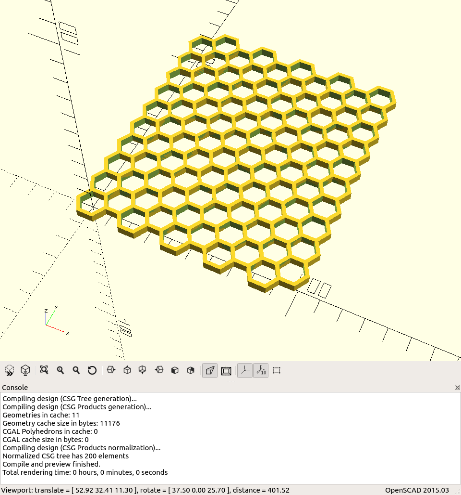

# Generate repeating hexagon grid in OpenSCAD

## Usage

1. Put `hex-grid.scad` in your library directory
2. Import and use:

```scad
use <hex-grid.scad>;

hex_grid(
    diameter=16, // External point-to-point distance of a single hexagon
    thickness=2, // Thickness of each hexagon's walls
    depth=4,     // How tall the grid will be
    rows=10,     // The number of rows of hexagons in the grid
    columns=10   // The number of columns of hexagons in the grid
)
```

This will render:


